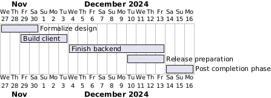

# cli-blg
Microblogging from the command line!

Still WIP

Project picked back up recently:


#### Setting up the backend
1. Create virtual environment

On Windows
```
# Create a virtual environment
cd backend
python -m venv env

# Activate the virtual environment
env\Scripts\activate
```

On MacOs/Linux
```
# Create a virtual environment
python3 -m venv env

# Activate the virtual environment
source env/bin/activate
```

2. Install dependencies.
```
pip install -r requirements.txt
``` 
3. Create config file
```
touch .env
```

Example config:
```
TITLE= "publsh ~salcedoa"
TIMEFORMAT= '%b %d %Y @ %H:%M'
POSTS_PER_PAGE= 10
```


4. Start Flask server.
```
flask --app app run
```

Debug mode
```
flask --app app run --debug
```
